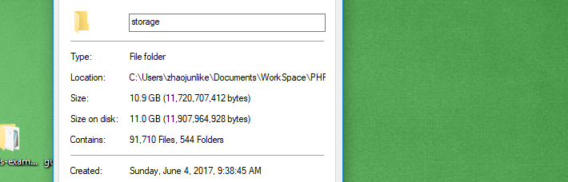

### 某站全套妹子图采集

10G 资源采集图

半天之内基本搞定 10G

### Usage

如果需要本地使用，请切换到 autoversion 版本分支

#### 安装依赖包

```$xslt
npm install
```

#### 配置 redis

```$xslt

##### 下载
window版本下载地址：https://github.com/MicrosoftArchive/redis/releases

##### 安装
https://www.cnblogs.com/wxjnew/p/9160855.html

##### 配置
https://www.cnblogs.com/chengxs/p/9090819.html

```

#### 服务器存储

```$xslt
如果需要服务器存储数据，请对接相关Api地址
```

#### 测试和运行

```$xslt
node app.js
```

### 效果图


